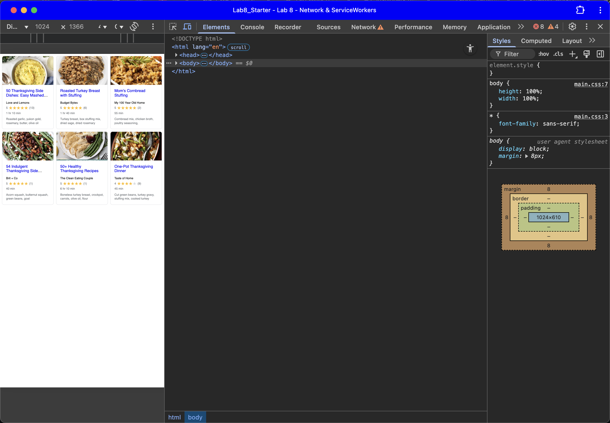

# Lab8-Starter

https://joshjppark.github.io/Lab8_Starter/

Graceful degradation and service workers
 
Graceful degradation is a way to ensure that the website still functions despite when certain functionalities fail. Service workers contribute to graceful degradation because it attempts to run the website without internet connection.

pwa image
